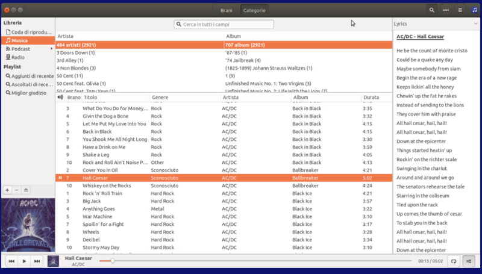

lLyrics
===============

lLyrics è un plugin per [Rhythmbox](http://projects.gnome.org/rhythmbox/), che visualizza il testo della canzone in riproduzione corrente nella barra laterale.
È inteso come una sostituzione del plugin integrato per i testi di Rhythmbox con più funzioni, una migliore integrazione dell'interfaccia utente e più motori per i testi.
Questa è la traduzione italiana

Sorgenti Lyrics 
---------------

  - Lyricwiki.org
  - Letras.terra.com.br
  - Vagalume.com.br
  - Metrolyrics.com
  - AZLyrics.com
  - Lyricsnmusic.com
  - Lyricsmania.com
  - Genius.com
  - Darklyrics.com
  - Chartlyrics.com

E' anche possibile recuperare i testi dal plugin integrato di Rhythmbox, ma questo non è raccomandato, in quanto presenta alcuni bug e può causare instabilità.

Requisiti
---------------

Il ramo "master" supporta Rhythmbox 3.0 e superiori. **È incompatibile con le versioni precedenti di Rhythmbox 2.xx!**

Per ottenere il plugin per Rhythmbox 2.xx, passare al ramo 'RB2'! Fornisce l'ultima versione compatibile con Rhythmbox 2.xx, ma si prega di notare che non sarà aggiornato o sviluppato ulteriormente.
Per installare lLyrics from source è necessario il pacchetto  `gettext`.

#### Dipendenze ####

lLyrics può essere eseguito senza la necessità di pacchetti aggiuntivi, ma si raccomanda di installare il modulo python **"chardet"** per una migliore gestione delle diverse codifiche.

Installazione
---------------

#### Ubuntu & derivate: PPA ####

Nelle distribuzioni basate su Ubuntu, è possibile installare questo plugin tramite [Questo PPA by fossfreedom](https://launchpad.net/~fossfreedom/+archive/rhythmbox-plugins).

#### Archlinux: AUR ####

L'utente di Archlinux può installare il plugin tramite [Questo AUR package](https://aur.archlinux.org/packages/rhythmbox-llyrics/).

#### Installatione manuale ####

	1.) Clicca sul pulsante  "Download ZIP" e estrai il file *.zip.

	2.) Passare alla cartella estratta e aprire un terminale.

	3.) Esegui `make install`.

	4.) Abilita plugin all'interno di Rhythmbox.

Ti chiederà la tua password di sudo, ma non preoccuparti, è sufficiente installare il file di schema necessario per salvare le tue preferenze.
Se si desidera installare il plugin a livello di sistema per tutti gli utenti, eseguire `make install-systemwide` al punto 3.

Per disinstallare, eseguire `make uninstall`.

Si noti che è necessario Rhythmbox versione 2.90 o superiore per eseguire lLyrics!

Caratteristiche
---------------
  - Supporto per molti siti di testi diversi (vedi sopra)
  - Integrazione nell'interfaccia utente di Rhythmbox
  - Le fonti dei testi possono essere prioritarie e disattivate.
  - Visualizzazione automatica dei testi in riproduzione o solo su richiesta
  - Salvare i testi recuperati in un file (può essere disattivato)
  - Possibilità di modificare i testi
  - Correggere il tag artista/titolo tramite Last.fm API per risultati migliori
  - Aspetto personalizzabile per adattarsi ai vostri desideri o allo spazio disponibile sullo schermo
  - Supporto di base per testi sincronizzati
  - altro.....

Crediti
---------------

Sono stato ispirato dal fantastico plugin di Songbird [MLyrics](https://github.com/FreeleX/MLyrics).
Grazie a tutti coloro che contribuiscono, segnalano problemi o aiutano in qualsiasi altro modo a migliorare questo plugin.

Troverete sempre l'ultima versione su [GitHub](https://github.com/dmo60/lLyrics).
Si prega di segnalare bug, problemi o richieste di funzionalità.

L'aiuto con le traduzioni è sempre apprezzato!

Tutti i testi sono proprietà e copyright dei loro proprietari.
